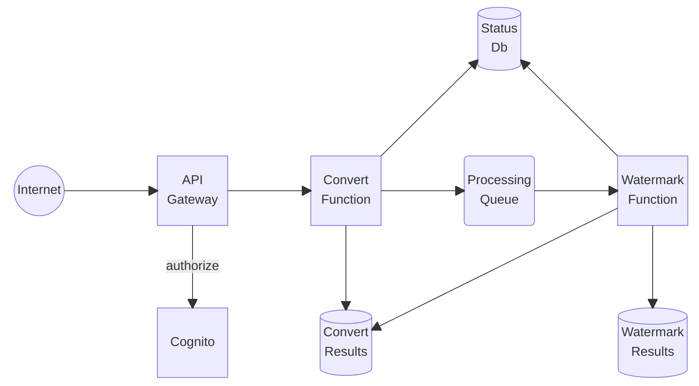

# Convert and Watermark Documents

Link: https://aws.amazon.com/blogs/architecture/convert-and-watermark-documents-automatically-with-amazon-s3-object-lambda/

```mermaid
block-beta
    columns 9
    space:6 db[("Status\nDb")] space:2

    space:9
    
    ext(("Internet")) space
    gw["API\nGateway"] space
    convert["Convert\nFunction"] space 
    queue("Processing\nQueue") space
    watermark["Watermark\nFunction"]
    
    space:9 
    
    space:2 auth["Cognito"] space
    result1[("Convert\nResults")] space:3
    result2[("Watermark\nResults")]

    ext --> gw
    gw -- "authorize" --> auth
    gw --> convert
    convert --> queue
    queue --> watermark
    convert --> result1
    watermark --> result1
    watermark --> result2
    convert --> db
    watermark --> db
```
